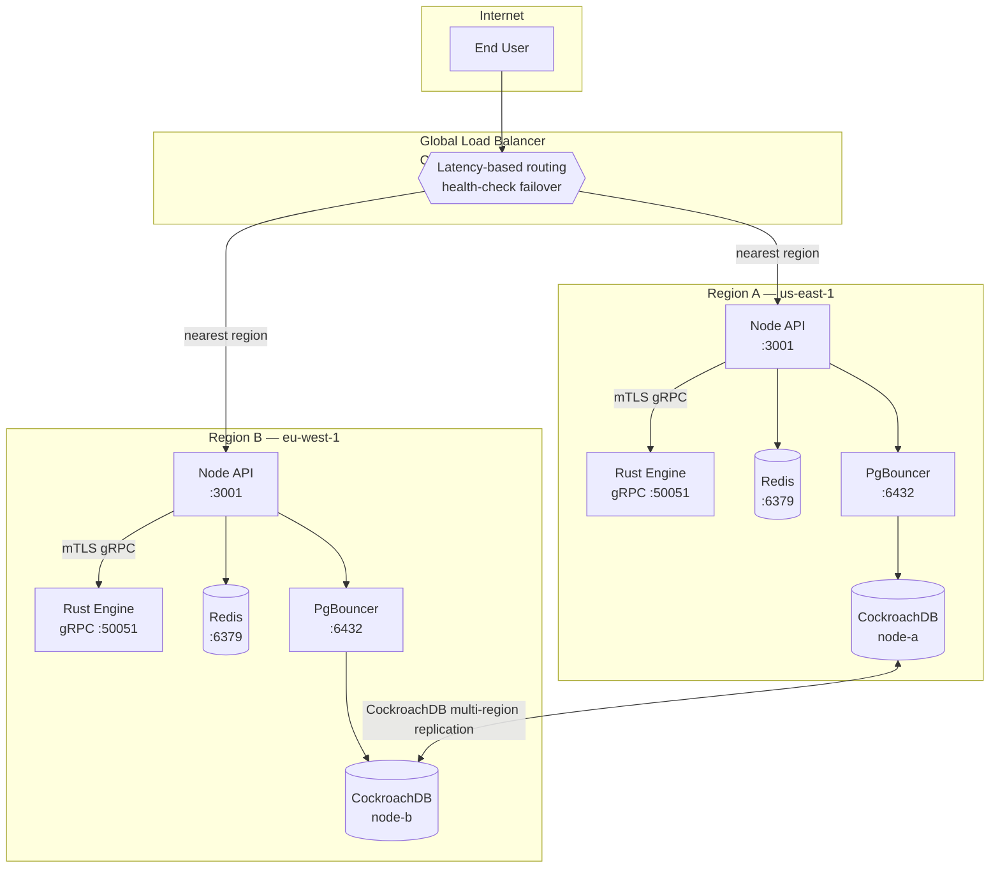

# Multi-Region Active-Active Deployment Architecture

> Phase 14 — Performance | Issue #240

## Overview

This document describes the architecture for deploying Fluid in an active-active
multi-region configuration.  Each region runs a full stack (API + Rust engine +
database), requests are routed to the nearest region, and data is kept consistent
through distributed database replication.

---

## Architecture Diagram



---

## Component Responsibilities

| Component | Role |
|-----------|------|
| **Cloudflare Load Balancer / Route 53** | Latency-based DNS routing + health-check-driven failover |
| **Node API** | Request handling, rate limiting, OFAC screening, fee-bump orchestration |
| **Rust Engine** | High-throughput gRPC signing over mTLS |
| **CockroachDB** | Distributed SQL — active-active reads and writes in both regions |
| **Redis (per region)** | Local API-key cache and rate-limit counters (GCRA) |
| **PgBouncer (per region)** | Connection pooling in front of CockroachDB |

---

## Database Synchronisation Strategy

### Recommended: CockroachDB Multi-Region

CockroachDB is the primary recommendation because:

- **Truly active-active** — both regions accept reads and writes simultaneously.
- **Raft-based consensus** — no single primary; any node can serve any transaction.
- **Low-latency local reads** — with `REGIONAL BY ROW` table locality, rows are
  homed to the nearest region; reads do not require a round-trip to another region.
- **Automatic failover** — if a region becomes unreachable, the surviving region
  automatically serves all traffic within seconds.

#### Table Locality Configuration

```sql
-- Tenant data homed to the region where it was created
ALTER TABLE tenants ADD COLUMN region crdb_internal_region
  AS (gateway_region()) STORED;
ALTER TABLE tenants SET LOCALITY REGIONAL BY ROW AS "region";

-- Global tables replicated to all regions for fast reads everywhere
ALTER TABLE subscription_tiers SET LOCALITY GLOBAL;
ALTER TABLE chains SET LOCALITY GLOBAL;
```

### Alternative: Citus (PostgreSQL Horizontal Sharding)

Citus shards tenant data across worker nodes and can be deployed in each region
with cross-region logical replication from primary to replica workers.  This is
suitable when PostgreSQL compatibility is a hard requirement, at the cost of
slightly higher write latency for cross-shard transactions.

---

## Global Load Balancer Configuration

### Cloudflare Load Balancer

```
Origin Pool A — us-east-1
  Origin: api-us-east.fluid.example.com  (health check: GET /health)
Origin Pool B — eu-west-1
  Origin: api-eu-west.fluid.example.com  (health check: GET /health)

Load Balancer Rule:
  Steering policy: Proximity (routes to geographically nearest pool)
  Failover: pool-A fallback → pool-B; pool-B fallback → pool-A
  Session affinity: none (stateless API — Redis holds per-user state)
```

### AWS Route 53 Latency-Based Routing

```
Record: api.fluid.example.com  A  us-east-1  [latency record]
Record: api.fluid.example.com  A  eu-west-1  [latency record]
Health checks: HTTP on /health (threshold: 3 failures → failover)
```

---

## Terraform Infrastructure

The Terraform modules are located in [`infra/terraform/multi-region/`](../infra/terraform/multi-region/).

```bash
cd infra/terraform/multi-region
terraform init
terraform plan -var-file=staging.tfvars
terraform apply -var-file=staging.tfvars
```

See [`infra/terraform/multi-region/README.md`](../infra/terraform/multi-region/README.md)
for full usage instructions.

---

## Operational Considerations

### Stateless API Nodes

Each Node API instance must run with `STATELESS_MODE=true`.  All shared state
(API-key cache, rate-limit counters) is stored in Redis.  Redis is deployed
per-region; the GCRA leaky-bucket counters are eventually consistent across
regions (acceptable — rate limit precision within a single region is sufficient).

### Data Residency

CockroachDB's `REGIONAL BY ROW` locality ensures tenant data is physically stored
in the region closest to the tenant.  Cross-region replication still occurs for
durability, but queries read locally.

### Key New Environment Variables

| Variable | Description |
|----------|-------------|
| `REGION_NAME` | Logical region name (`us-east-1`, `eu-west-1`, …) — used in logs and metrics |
| `DATABASE_URL` | CockroachDB DSN for the local node |
| `DATABASE_REPLICA_URL` | Read-replica DSN (can point to a different CockroachDB node) |
| `STATELESS_MODE` | Must be `true` in multi-region to prevent split-brain rate limits |
| `REDIS_URL` | Per-region Redis connection string |

See [`.env.example`](../.env.example) for the full list.
